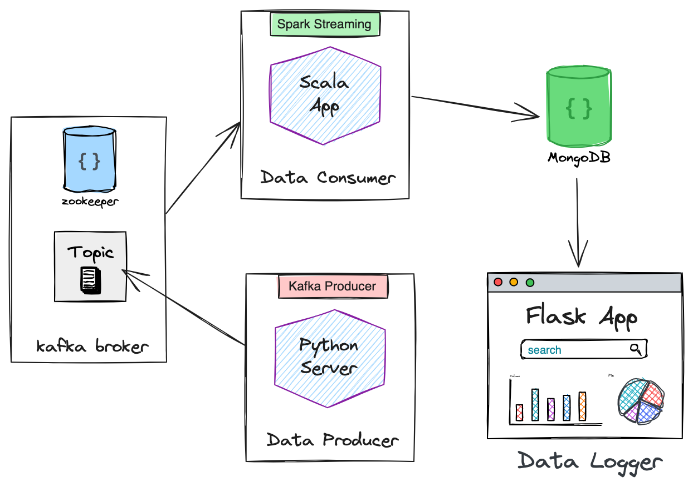
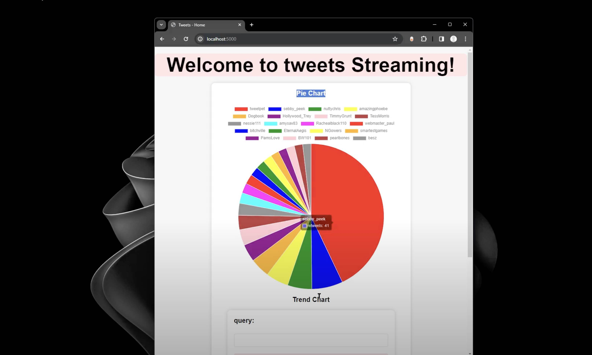

This application is designed to stream tweets in real-time, process, and log the data using a modern tech stack that includes Zookeeper, Kafka, and Flask.

## Overview:

## demo:

theres a demo video in the docs folder

## Used Technologies

- Spark Streaming using Scala API (sbt build)
- Apache Kafka (with zookeeper)
- Flask (Python) for the web interface
- MongoDB for storing the data

### Installation

To start the application you need to have previous technologies already setup on your device, then do the following:

1. Clone the repository & get tweets dataset

2. Start Zookeeper and Kafka Broker (requires to have a topic already created)

3. Set up the Python environment

4. Run the Flask application

## Usage

Once everything is set up and the application is running, it will start consuming tweets from the specified dataset, processing them through Kafka streams, and logging the data. The Flask application provides a simple web interface for monitoring the status and results of the data logging process.
